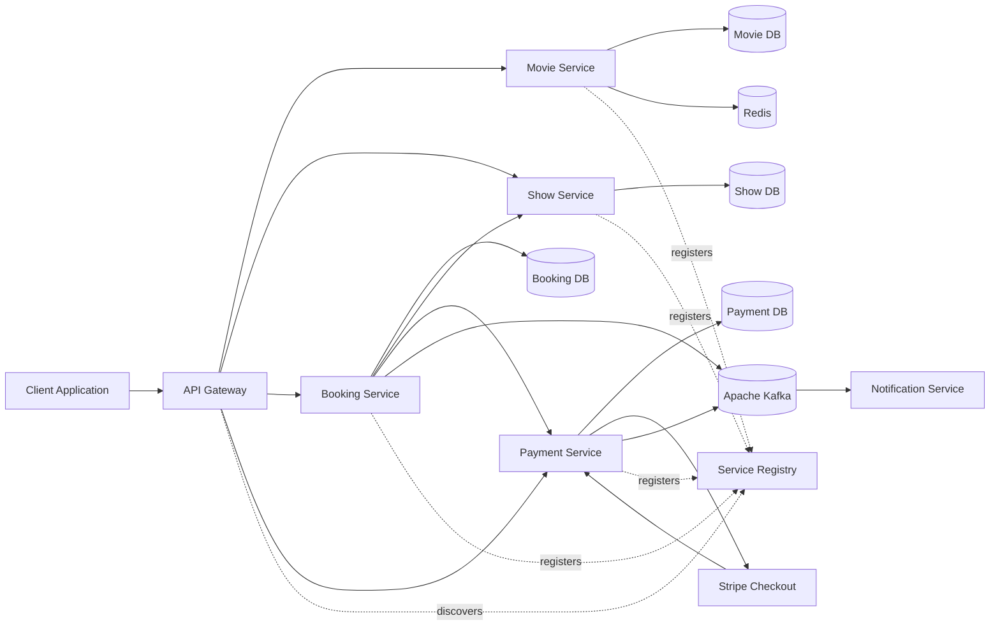
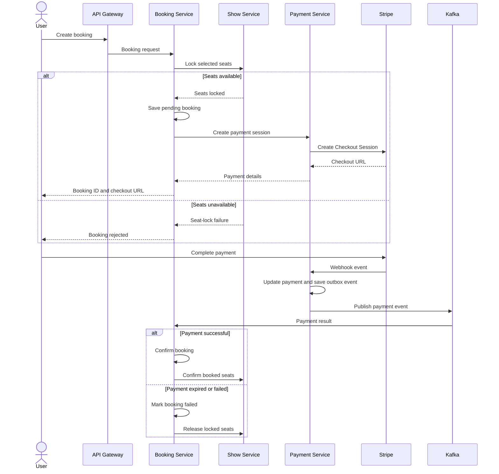

# Distributed Event-Driven Ticket Booking System

A scalable, distributed ticket-booking platform built using **Java, Spring Boot, Kafka, MySQL, Redis, Docker, and Stripe**.

The system follows a microservices architecture and demonstrates practical backend engineering concepts such as:

* Concurrent seat locking
* Event-driven communication
* Saga-based transaction management
* Transactional Outbox Pattern
* Consumer idempotency
* Payment processing with Stripe
* Centralized API routing
* Service discovery
* Distributed caching
* Retry and Dead Letter Queue handling
* Monitoring and centralized logging

> This project is being developed as a backend system-design and microservices implementation project.

---

## Architecture



---

## Core Features

### Movie Management

* Create, update, retrieve, and delete movies
* Manage movie languages and genres
* Cache frequently requested movie data using Redis
* Automatically invalidate cached data after updates or deletion

### Theatre and Show Management

* Manage theatres, screens, and seats
* Configure seat categories and prices
* Schedule movie shows
* Prevent overlapping shows on the same screen
* Maintain seat availability independently for every show

### Concurrent Seat Locking

* Temporarily lock selected seats before payment
* Configurable seat-lock expiration period
* Prevent duplicate seats in a booking request
* Validate that every requested seat belongs to the selected show
* Prevent multiple users from booking the same seat concurrently
* Automatically treat expired locks as available
* Process seat locks in a deterministic order to reduce deadlock risk

### Booking Management

* Create bookings for one or more seats
* Maintain booking lifecycle states
* Associate bookings with users, shows, seats, and payments
* Store the seat-lock expiry time
* Confirm or fail bookings according to payment events
* Execute compensating operations when a distributed step fails

### Stripe Payment Integration

* Create Stripe Checkout sessions
* Redirect users to Stripe-hosted payment pages
* Verify webhook signatures before processing events
* Handle successful and expired checkout sessions
* Keep payment confirmation independent of browser redirects
* Associate every payment with its corresponding booking

### Event-Driven Processing

* Publish domain events through Apache Kafka
* Use the booking ID as a Kafka message key where ordering is required
* Retry transient processing failures
* Forward repeatedly failing events to a Dead Letter Topic
* Allow services to react asynchronously without tight runtime coupling

### Transactional Outbox Pattern

Payment and booking events are first stored in the service database within the same transaction as the business-state change.

A background poller then:

1. Reads unprocessed outbox records
2. Publishes them to Kafka
3. Marks successfully published records as processed

This prevents the database state from being committed without the corresponding event being recorded.

### Idempotent Event Consumption

Consumers maintain an idempotency record using business identifiers such as:

```text
bookingId + paymentId + eventType
```

Duplicate Kafka deliveries therefore do not apply the same business transition multiple times.

---

## Microservices

| Service              | Responsibility                                                  |
| -------------------- | --------------------------------------------------------------- |
| API Gateway          | Central entry point, request routing, and cross-cutting filters |
| Service Registry     | Service registration and discovery using Eureka                 |
| Movie Service        | Movie, language, and genre management                           |
| Show Service         | Theatre, screen, show, seat-pricing, and seat-lock management   |
| Booking Service      | Booking creation, booking lifecycle                             |
| Payment Service      | Stripe Checkout, webhook processing, and payment events         |
| Notification Service | Customer notifications triggered by booking events              |
| Outbox Poller        | Publishes pending database outbox events to Kafka               |

Each business service owns its own database and does not directly update another service's tables.

---

## Booking Flow



---

## Booking States

A booking can move through states similar to:

```text
PENDING
   |
   +---- Payment Successful ----> CONFIRMED
   |
   +---- Payment Failed --------> FAILED
   |
   +---- Payment Expired -------> FALED
```

A booking is not considered confirmed only because the user reaches the Stripe success URL. The final payment state is determined using a verified Stripe webhook.

---

## Seat States

```text
AVAILABLE
   |
   +---- Seat selected ---------> LOCKED
   |                                 |
   |                                 +---- Payment success ---> BOOKED
   |                                 |
   |                                 +---- Lock expires ------> AVAILABLE
   |
   +---- Booking cancelled -----> AVAILABLE
```

Each seat lock is associated with a booking and an expiration timestamp.

---

## Reliability and Consistency

### Database Transactions

Each service uses local database transactions for changes within its own boundary.

A single distributed database transaction is intentionally avoided.

### Saga Pattern

The booking workflow uses a Saga to coordinate operations across the Booking, Show, and Payment services.

Example compensating actions include:

* Release seats when payment expires
* Mark a booking as failed when payment cannot be completed
* Ignore duplicate payment events
* Mark booking as success and seat as confirmed for a payment success event

### Optimistic and Pessimistic Concurrency Control

Seat availability is verified and modified inside a database transaction.

Depending on the repository implementation, row-level locking or version-based optimistic locking can be used to ensure that two simultaneous requests cannot successfully lock the same seat.

### Idempotency

Operations that can be delivered more than once are designed to be idempotent.

Examples include:

* Stripe webhook handling
* Kafka event consumption
* Booking confirmation
* Seat release
* Outbox publication

### Retry and Dead Letter Queue

Transient Kafka consumer failures are retried with backoff.

Events that continue to fail are sent to a Dead Letter Topic for investigation or controlled replay.

---

## Technology Stack

### Backend

* Java
* Spring Boot
* Spring Cloud
* Spring Data JPA
* Spring Cloud Gateway
* Spring Cloud OpenFeign
* Spring Cloud Netflix Eureka
* Spring Kafka

### Databases and Caching

* MySQL
* Redis

### Messaging

* Apache Kafka

### Payments

* Stripe Checkout
* Stripe Webhooks
* Stripe CLI for local webhook forwarding

### DevOps

* Docker
* Docker Compose
* Gradle

### Observability

* Spring Boot Actuator
* Prometheus
* Grafana
* Loki
* OpenTelemetry


---

## Prerequisites

Install the following tools before running the project:

* Java 17 or later
* Docker
* Docker Compose
* Gradle, or use the included Gradle Wrapper
* Stripe CLI for local payment webhook testing

Verify the installation:

```bash
java --version
docker --version
docker compose version
```

---

## Running the Project

### 1. Clone the Repository

```bash
git clone https://github.com/<your-username>/<your-repository>.git
cd <your-repository>
```

### 2. Configure Environment Variables

Create a `.env` file in the project root:

```env
MYSQL_ROOT_PASSWORD=your_mysql_password

STRIPE_API_KEY=sk_test_your_key
STRIPE_WEBHOOK_SECRET=whsec_your_webhook_secret

KEYCLOAK_ADMIN=admin
KEYCLOAK_ADMIN_PASSWORD=admin
```

Never commit actual Stripe keys, database passwords, JWT secrets, or webhook secrets to Git.

Add the following entries to `.gitignore`:

```gitignore
.env
*.log
.idea/
build/
.gradle/
```

### 3. Start Infrastructure

```bash
docker compose up -d
```

Check the running containers:

```bash
docker compose ps
```

### 4. Build the Services

On Linux or macOS:

```bash
./gradlew clean build
```

On Windows:

```powershell
gradlew.bat clean build
```

### 5. Run an Individual Service

```bash
./gradlew :booking-service:bootRun
```

Alternatively, run all services through Docker Compose:

```bash
docker compose up --build
```

---

## Stripe Webhook Setup

Log in through the Stripe CLI:

```bash
stripe login
```

Forward Stripe events to the Payment Service:

```bash
stripe listen \
  --forward-to localhost:9071/api/webhook
```

The CLI prints a webhook signing secret similar to:

```text
whsec_************************
```

Set this value as:

```env
STRIPE_WEBHOOK_SECRET=whsec_************************
```

Restart the Payment Service after changing the environment variable.

### Important Stripe Events

The Payment Service processes events:

```text
checkout.session.completed
checkout.session.expired
```

The exact payment event set can be extended according to the payment methods supported by the system.

---

## Kafka Events

```text
payment-success
payment-expire
booking-confirm
booking-fail
seat-fail
seat-release
seat-confirm
```

Topic names should be configurable through application properties instead of being hardcoded.

---

## Database Ownership

Each service owns its data.

```text
Movie Service   -> moviesdb
Show Service    -> showsdb
Booking Service -> bookingsdb
Payment Service -> paymentsdb
```

Services communicate through REST APIs or Kafka events instead of directly reading another service's database.

---

## Outbox Record

A typical outbox record contains:

```text
id
aggregateId
bookingId
paymentId
eventType
topic
payload
processed
createdAt
```

The business update and outbox insert are committed in one local database transaction.

---

## Redis Caching

Redis is used to cache frequently requested data such as movie details.

Typical cache flow:

```text
Request
   |
   +---- Cache hit ----> Return cached response
   |
   +---- Cache miss ---> Query database
                         Store result in Redis
                         Return response
```

Cache entries are evicted whenever the underlying movie data is updated or deleted.

---

## Monitoring

Spring Boot Actuator exposes service health and application metrics.

Example endpoints:

```text
/actuator/health
/actuator/info
/actuator/metrics
/actuator/prometheus
```

Prometheus collects application metrics, while Grafana is used for visualization.

Loki and Promtail provide centralized log aggregation across services.

---

## Testing

The project can include:

* Unit tests for business logic
* Repository tests
* Controller integration tests
* Kafka producer and consumer integration tests
* Testcontainers-based MySQL, Redis, and Kafka tests
* Stripe webhook signature-validation tests
* Concurrency tests for simultaneous seat-lock requests
* End-to-end booking-flow tests

Run the tests using:

```bash
./gradlew test
```

---

## Key Engineering Challenges

### Preventing Double Booking

Two users may attempt to lock the same seat simultaneously.

The system solves this by validating and updating seat state inside a database transaction using appropriate row-locking or optimistic-locking semantics.

### Maintaining Cross-Service Consistency

Booking, payment, and seat information belong to different services.

The system uses Saga-based state transitions and compensating actions instead of a distributed ACID transaction.

### Preventing Lost Events

A database update may succeed while direct Kafka publication fails.

The Transactional Outbox Pattern ensures that the event remains stored and can be published later.

### Handling Duplicate Messages

Kafka and webhook deliveries may occur more than once.

Idempotency records and state-transition checks ensure that duplicate deliveries do not cause duplicate confirmations, refunds, or seat updates.

### Handling Payment Race Conditions

Payment confirmation can arrive close to the seat-lock expiry time.

The Booking Service validates the current booking and payment state before applying the transition and triggers compensation or reconciliation when required.

---

## Current Development Status

Implemented or under active development:

* Microservice-based architecture
* Eureka service discovery
* API Gateway
* Movie management
* Redis caching
* Theatre, screen, seat, and show management
* Show-overlap validation
* Concurrent seat locking
* Booking and payment persistence
* Stripe Checkout integration
* Stripe webhook processing
* Kafka-based payment events
* Transactional Outbox Pattern
* Consumer idempotency
* Retry and Dead Letter Queue handling
* Docker-based local infrastructure
* Centralized monitoring and logging

---

## Future Enhancements

* Complete notification delivery through email or SMS
* Add automatic refund and reconciliation workflows
* Add distributed tracing across all services
* Add contract testing between services
* Add Testcontainers-based integration tests
* Add Kubernetes manifests and Helm charts
* Add rate limiting at the API Gateway
* Add a reservation waiting queue for high-demand shows
* Add dynamic pricing based on seat demand
* Add an administrative dashboard
* Add CI/CD pipelines for automated testing and deployment
* Add schema-registry-based event contracts
* Add outbox cleanup and archival policies

---

## Design Principles

The project follows these principles:

* Database per service
* Loose coupling through asynchronous events
* Explicit service boundaries
* Idempotent consumers
* Failure-aware workflows
* Observable services
* Secure secret management
* Stateless application instances where possible
* Horizontal scalability
* Backward-compatible event evolution

---

## Disclaimer

This project is intended for learning, experimentation, and system-design demonstration.

Before production deployment, additional work would be required around:

* Security hardening
* PCI-related responsibilities
* Secret management
* Data privacy
* Audit logging
* Disaster recovery
* Load testing
* Event-schema governance
* Automated reconciliation
* Production-grade deployment and alerting

---

## Author

**Suyash Aparajit**

Java Backend Developer focused on:

* Spring Boot
* Microservices
* Kafka
* Distributed systems
* System design
* CI/CD and cloud-native deployment

---

## License

This project is available for educational and demonstration purposes.

Add an appropriate open-source license, such as the MIT License, before distributing or accepting external contributions.
