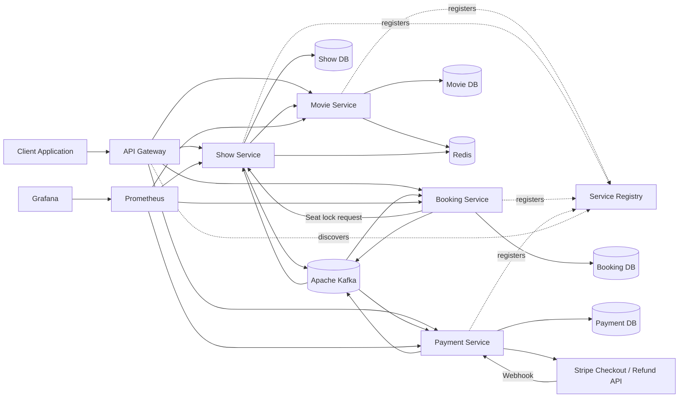
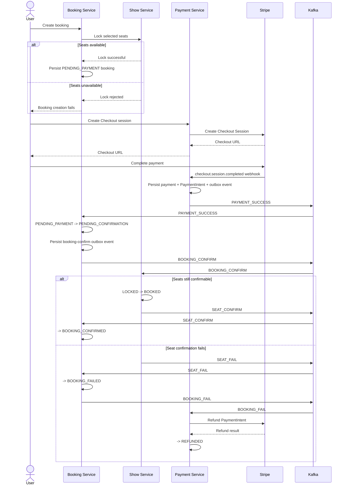

# Distributed Event-Driven Ticket Booking System

A distributed ticket-booking backend built with **Java, Spring Boot, Kafka, MySQL, Redis, Docker, and Stripe**.

The project focuses on practical backend and distributed-systems problems rather than only CRUD APIs. It currently demonstrates:

* Concurrent seat locking with optimistic locking
* Event-driven communication with Apache Kafka
* Saga-based booking coordination and compensation
* Transactional Outbox Pattern
* Idempotent event consumption
* Stripe Checkout and webhook-driven payment confirmation
* Real Stripe refund compensation for failed bookings
* Database-per-service ownership
* Eureka service discovery and API Gateway routing
* Redis caching
* Prometheus and Grafana monitoring

> This is a system-design and microservices learning project. Automated testing and distributed tracing are the current major areas of improvement.

---

## Architecture



The initial seat-lock request is synchronous because the user needs an immediate availability response. Payment confirmation and subsequent Saga transitions are propagated asynchronously through Kafka.

---

## Core Features

### Movie Management

* Create, update, retrieve, and delete movies
* Manage movie languages and genres
* Cache frequently requested movie data using Redis
* Evict cached movie data after updates or deletion

### Theatre and Show Management

* Manage theatres, screens, seats, and shows
* Configure seat categories and show-specific prices
* Prevent overlapping shows on the same screen
* Maintain seat availability independently for every show

### Concurrent Seat Locking

Selected seats are temporarily locked before payment.

The locking flow includes:

* Duplicate-seat validation within a request
* Validation that requested seats belong to the selected show
* Temporary `LOCKED` ownership using the booking ID
* Lock-expiry timestamps
* Optimistic locking using entity versioning
* Deterministic seat processing order
* Automatic release of expired locks
* State guards preventing `BOOKED` seats from being released by the expiry workflow

```text
AVAILABLE
   |
   +---- Seat selected ---------> LOCKED
                                    |
                                    +---- Confirmation ----> BOOKED
                                    |
                                    +---- Lock expires ----> AVAILABLE
                                    |
                                    +---- Saga failure ----> AVAILABLE
```

---

## Booking Lifecycle

The Booking Service coordinates the distributed booking workflow.

Current booking states include:

```text
PENDING_PAYMENT
      |
      +---- Payment succeeded ----> PENDING_CONFIRMATION
                                          |
                                          +---- Seats confirmed ----> BOOKING_CONFIRMED
                                          |
                                          +---- Confirmation fails -> BOOKING_FAILED

PENDING_PAYMENT
      |
      +---- Payment expires/fails ------------------------> BOOKING_FAILED
```

A booking is **not** confirmed because the browser reaches a Stripe success URL. Payment state is finalized from a verified Stripe webhook.

---

## Payment and Saga Flow



---

## Stripe Payment Integration

The Payment Service integrates with Stripe Checkout and treats Stripe webhooks as the authoritative payment signal.

Implemented behaviour:

* Create Stripe Checkout sessions
* Redirect the client to Stripe-hosted Checkout
* Verify webhook signatures
* Handle `checkout.session.completed`
* Handle `checkout.session.expired`
* Capture and persist the Stripe PaymentIntent ID after successful Checkout
* Associate payments with bookings
* Publish payment outcomes through the transactional outbox

### Refund Compensation

If payment succeeds but the downstream booking/seat confirmation fails, the Saga triggers a real Stripe refund.

```text
BOOKING_FAILED event
        |
        v
Payment Service loads successful payment
        |
        v
Stripe Refund API using stored PaymentIntent ID
        |
        v
Refund succeeds
        |
        v
Local payment state -> REFUNDED
```

Duplicate compensation events are guarded so the same logical payment is not refunded repeatedly by the application workflow.

---

## Transactional Outbox Pattern

Business state changes and their corresponding domain events are stored in the same local database transaction.

A background poller then:

1. Reads unprocessed outbox records
2. Publishes them to Kafka
3. Marks successfully published records as processed

```text
Local transaction
-----------------------------
Update business state
Insert outbox event
-----------------------------
          |
        COMMIT
          |
          v
     Outbox Poller
          |
          v
        Kafka
```

This prevents the classic failure mode where a database update succeeds but the corresponding event is never recorded for publication.

---

## Idempotent Event Consumption

Kafka and webhook deliveries may occur more than once.

Consumers persist idempotency records using business identifiers such as:

```text
bookingId + paymentId + eventType
```

Unique database constraints and state-transition checks prevent duplicate deliveries from applying the same logical operation multiple times.

This is especially important for:

* Payment-success processing
* Booking confirmation
* Seat confirmation/release
* Refund compensation

---

## Reliability and Consistency

### Local Transactions

Each service owns its own database and uses local ACID transactions inside its service boundary.

The system intentionally avoids a distributed database transaction across Booking, Show, and Payment.

### Saga Pattern

Cross-service consistency is maintained using events and compensating actions.

Examples:

* Release locked seats when payment expires
* Fail a booking when seat confirmation cannot complete
* Refund an already successful Stripe payment when the booking cannot be completed
* Ignore duplicate event deliveries through idempotency controls

### Optimistic Concurrency Control

Seat entities use version-based optimistic locking so simultaneous requests cannot silently overwrite each other's state.

The core invariant is:

> A seat may transition back to `AVAILABLE` only from a valid lock/release path. A `BOOKED` seat must not be released by the expiry poller.

---

## Microservices

| Component       | Responsibility                                                      |
| --------------- | ------------------------------------------------------------------- |
| API Gateway     | Central entry point and service routing                             |
| Eureka Server   | Service registration and discovery                                  |
| Movie Service   | Movie, language, and genre management                               |
| Show Service    | Theatre, screen, show, pricing, seat availability, and seat locking |
| Booking Service | Booking creation, lifecycle management, and Saga coordination       |
| Payment Service | Stripe Checkout, webhook handling, payment state, and refunds       |
| Outbox Pollers  | Background publication of persisted domain events to Kafka          |

Each business service owns its own database and does not directly update another service's tables.

---

## Database Ownership

```text
Movie Service   -> moviesdb
Show Service    -> showsdb
Booking Service -> bookingsdb
Payment Service -> paymentsdb
```

Services communicate through REST calls or Kafka events rather than sharing database tables.

---

## Kafka Events

The current workflow uses topics including:

```text
payment-succeed
payment-expire
booking-confirm
booking-fail
seat-confirm
seat-fail
seat-release
```

Kafka is used for asynchronous Saga transitions between Payment, Booking, and Show services.

> Retry/backoff and Dead Letter Topic handling are not currently presented as completed features of the project.

---

## Redis Caching

Redis is used for frequently requested movie data.

```text
Request
   |
   +---- Cache hit ----> Return cached response
   |
   +---- Cache miss ---> Query MySQL
                         Store in Redis
                         Return response
```

Relevant cache entries are evicted when underlying movie data changes.

---

## Observability

Currently implemented:

* Spring Boot Actuator
* Prometheus metrics collection
* Grafana dashboards/data-source provisioning

Common Actuator endpoints include:

```text
/actuator/health
/actuator/info
/actuator/metrics
/actuator/prometheus
```

**OpenTelemetry + Tempo distributed tracing is planned next** so a single booking can be followed across synchronous REST calls and asynchronous Kafka Saga transitions.

---

## Technology Stack

### Backend

* Java 17+
* Spring Boot
* Spring Cloud
* Spring Data JPA
* Spring Cloud Gateway
* Spring Cloud OpenFeign
* Spring Cloud Netflix Eureka
* Spring Kafka

### Data

* MySQL
* Redis

### Messaging

* Apache Kafka

### Payments

* Stripe Checkout
* Stripe Webhooks
* Stripe Refund API
* Stripe CLI for local webhook forwarding

### Infrastructure and Observability

* Docker
* Docker Compose
* Gradle
* Spring Boot Actuator
* Prometheus
* Grafana

---

## Local Infrastructure

The current `docker-compose.yml` provides:

* Four MySQL databases
* Redis
* Kafka
* Eureka Server
* Movie Service
* Show Service
* Booking Service
* Payment Service
* Prometheus
* Grafana

Start the stack with:

```bash
docker compose up -d
```

Check container status:

```bash
docker compose ps
```

The API Gateway exists as a separate project module and can be run separately when required.

---

## Building a Service

Each service is maintained as its own Gradle project.

Example on Linux/macOS:

```bash
cd ticketBooking
./gradlew clean build
```

Example on Windows:

```powershell
cd ticketBooking
gradlew.bat clean build
```

Use the same pattern for `movie`, `show`, `payments`, `eurekaserver`, and `gatewayserver`.

---

## Stripe Configuration

The Payment Service expects Stripe credentials through environment variables:

```env
STRIPE_API_KEY=sk_test_...
STRIPE_WEBHOOK_KEY=whsec_...
```

Never commit real Stripe keys or webhook secrets.

For local webhook forwarding:

```bash
stripe login
stripe listen --forward-to localhost:8072/booking/payments/api/webhook
```

Copy the webhook signing secret printed by Stripe CLI into `STRIPE_WEBHOOK_KEY` and restart the Payment Service.

---

## Monitoring

Prometheus is exposed on:

```text
http://localhost:9090
```

Grafana is exposed on:

```text
http://localhost:3000
```

Service health can be inspected through Spring Boot Actuator readiness/health endpoints.

---

## Automated Testing — Current Focus

Automated testing is the main current development focus.

The goal is not to chase raw coverage percentage, but to verify the highest-risk business and distributed-system invariants, including:

* Available seats can be locked
* Active seat locks cannot be stolen
* Expired locks can be reclaimed/released
* `BOOKED` seats cannot be released by the expiry workflow
* Concurrent requests for the same seat result in only one successful owner
* `PAYMENT_SUCCESS` performs the expected booking transition and outbox write
* Missing/invalid bookings do not publish a success transition
* Duplicate Kafka events do not duplicate the business effect
* Seat confirmation completes the booking
* Outbox records survive Kafka publication failures
* Saga happy path completes consistently
* Saga compensation invokes Stripe refund correctly and remains idempotent

Planned tools include:

* JUnit 5
* Mockito
* Spring Boot integration testing
* Testcontainers for MySQL/Kafka where real infrastructure behaviour matters

---

## Key Engineering Challenges

### Preventing Double Booking

Two users can request the same seat at nearly the same time. Seat state is validated and changed transactionally, with optimistic locking and explicit state validation protecting the booking invariant.

### Handling Seat-Lock Expiry Races

Payment confirmation can arrive near the seat-lock expiry boundary. Version checks protect stale updates, while explicit state guards ensure a confirmed `BOOKED` seat cannot later be released by the expiry workflow.

### Maintaining Cross-Service Consistency

Booking, seat, and payment state live in different databases. The system uses Saga transitions and compensation instead of distributed ACID transactions.

### Preventing Lost Events

Business-state changes are written together with outbox records so Kafka publication can happen asynchronously without losing the event intent.

### Handling Duplicate Deliveries

Kafka/webhook events may be redelivered. Idempotency records and state checks prevent duplicate confirmations, releases, and refund operations.

### Compensating an External Payment

A successful Stripe payment does not guarantee the booking can still be completed. If downstream confirmation fails, the Payment Service uses the stored PaymentIntent to perform a real Stripe refund.

---

## Current Development Status

### Implemented

* Microservice-based architecture
* Eureka service discovery
* API Gateway module
* Movie management
* Redis caching
* Theatre, screen, seat, and show management
* Show-overlap validation
* Concurrent/expiring seat locking
* Booking and payment persistence
* Stripe Checkout integration
* Verified Stripe webhook processing
* Stripe PaymentIntent persistence
* Real Stripe refund compensation
* Kafka-based Saga events
* Transactional Outbox Pattern
* Consumer idempotency
* Docker-based local infrastructure
* Prometheus and Grafana monitoring

### In Progress / Next

* High-value automated unit/integration/concurrency tests
* OpenTelemetry + Tempo distributed tracing
* Structured application logging cleanup

---

## Possible Future Enhancements

These are optional extensions rather than claims about the current implementation:

* Kafka retry/backoff and Dead Letter Topic policy
* Notification delivery through email/SMS
* Contract testing between services
* Kubernetes/Helm deployment manifests
* API Gateway rate limiting
* Reservation waiting queue for high-demand shows
* Dynamic pricing
* CI/CD for automated build/test/deployment
* Schema Registry / versioned event contracts
* Outbox cleanup and archival policies

---

## Design Principles

* Database per service
* Explicit service boundaries
* Event-driven loose coupling where asynchronous coordination is useful
* Idempotent consumers
* Local transactions instead of distributed ACID
* Failure-aware Saga workflows
* Explicit business-state transitions
* External payment compensation
* Observable services
* Stateless service instances where practical

---

## Disclaimer

This project is intended for learning, experimentation, and system-design demonstration.

It should not be treated as a production-ready ticketing/payment platform without additional work around areas such as:

* Security hardening
* PCI and payment-compliance responsibilities
* Production secret management
* Data privacy and audit requirements
* Disaster recovery
* Load/stress testing
* Event-schema governance
* Operational reconciliation
* Production deployment, alerting, and runbooks

---

## Author

**Suyash Aparajit**

Java Backend Developer focused on:

* Spring Boot
* Microservices
* Kafka
* Distributed systems
* System design
* CI/CD and cloud-native deployment

---

## License

This project is available for educational and demonstration purposes.
